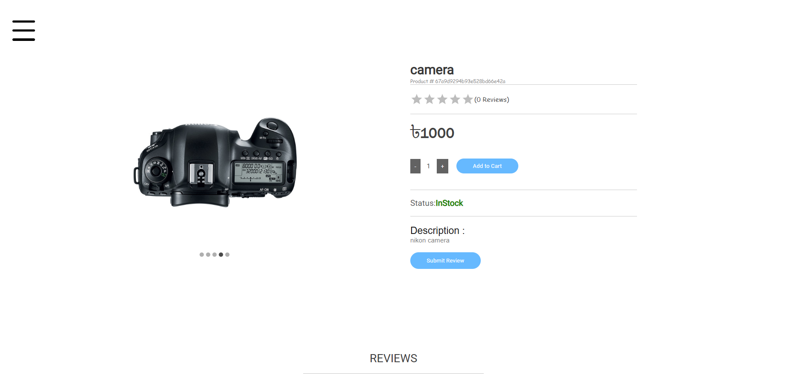
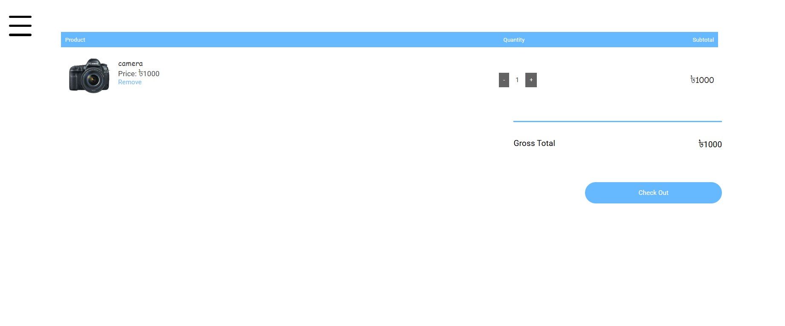

# 🛒 JUstore - MERN Stack E-Commerce Platform

JUstore is a full-featured e-commerce web application built using the MERN stack (MongoDB, Express.js, React, Node.js). It supports user authentication, product browsing, cart, order management, admin control, and Stripe payment integration.

---

## 🚀 Tech Stack

- **Frontend**: React, Redux, Material-UI
- **Backend**: Node.js, Express
- **Database**: MongoDB (with Mongoose)
- **Authentication**: JWT
- **Payments**: Stripe
- **Deployment**: Onrender, 

---

## ✨ Features

- 🔐 User registration & login with secure JWT authentication  
- 📦 Product listing, filtering, and search  
- 🛒 Add to cart and checkout functionality  
- 💳 Stripe integration for secure payments  
- 🧑‍💻 Admin dashboard for managing products, users, and orders  
- 📈 Order history and order status tracking  
- 📬 Contact form and dynamic shipping address management  

---

## 🖼️ Screenshots

> Below are 13 screenshots demonstrating the functionality of the application.

### 🏠 Home Page  

### 🛍️ Product Listing  

### 📄 Product Detail Page  

### 🔍 Search and Filter  

### 🛒 Shopping Cart  

### 🔐 User Login  

### 🧾 Checkout Page  

### 💳 Stripe Payment  

### ✅ Order Confirmation  

### 📜 Order History  

### 🧑‍💼 Admin Dashboard  

### 📋 Product Management (Admin)  

### 👥 User Management (Admin)  

---

## 📂 Folder Structure

